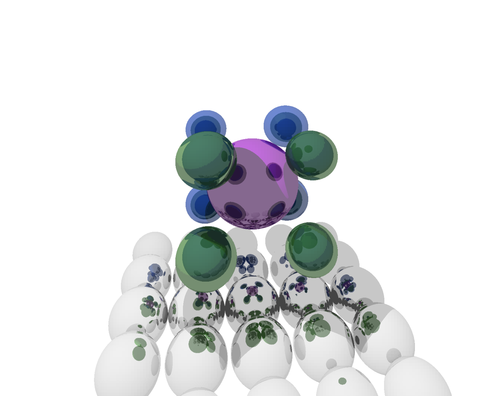

# N-Dimensional Raytracer

A raytracing rendering engine that supports rendering hyper-spheres (and later other objects?) in higher dimensions. Currently available are the dimensions 2 to 9 but higher dimensions would be theoretically possible. It just gets very computationally expensive.

All spheres are projects into the 2D plane that the camera screen is. So pretty much what we are used to from 3D space. You can imagine the process of projecting 4D space onto a 2D screen like taking a 1D "line scan" of 3D space.

## Getting Started

There is a convenient web frontend that you can use at [nd-raytracing.netlify.app](https://nd-raytracing.netlify.app/)

## Implementation

The rendering engine is implemented in Rust using a generic vector type. This allows us to use a fixed size (stack allocatable) struct while still having the ability to render arbitrary dimensions. We just need to let the compiler generate the code for each of our N-D renderers.

The web frontend is simply using a WebAssembly build and a WebWorkers to spread the computation over the available cores.

The canvas 2D API is used to put the pixels on the screen. The canvas is dynamically scaled to ensure a reasonable frame rate.
